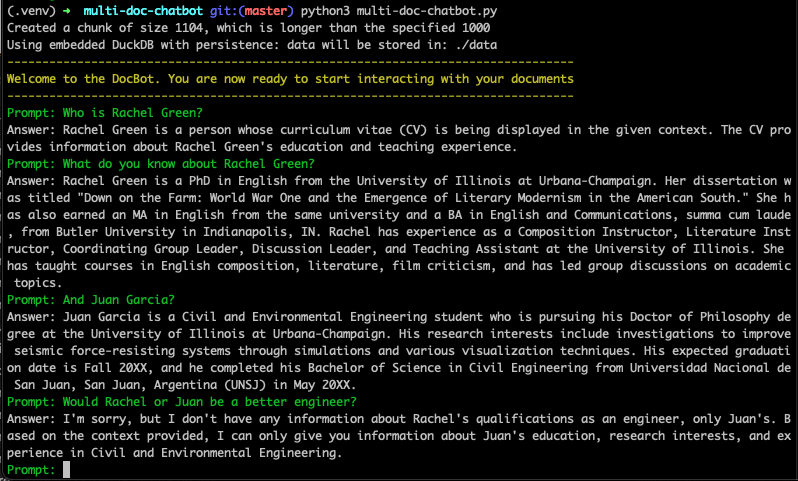

# Multi Document Reader and Chatbot using LangChain and OpenAI

[Updated January 2024 to work with LangChain v0.1.0]

## Summary
Provided here are a few python scripts to help get started with building your own multi document reader and chatbot.
The scripts increase in complexity and features, as follows:

`single-doc.py` Can handle interacting with a single pdf. Sends the entire document content to the LLM prompt.

`single-long-doc.py` Can handle interacting with a long single pdf. Uses embeddings and a vector store to handle
sending only relevant information to the LLM prompts.

`multi-doc-chatbot.py` Can handle interacting with multiple different documents and document types (.pdf, .dox, .txt), 
and remembers the chat history and recent conversations.
It uses embeddings and vector stores to send the relevant information to the LLM prompt. Also provides a chat interface
via the terminal using stdin and stdout. Press `q` to escape the chat window.

I wrote an article which explores some of the concepts here, as well as walks through building each of the scripts.
[Can read that here](https://medium.com/@ssmaameri/building-a-multi-document-reader-and-chatbot-with-langchain-and-chatgpt-d1864d47e339)


## Getting started


Clone the repository, set up the virtual environment, and install the required packages

```
git clone git@github.com:smaameri/multi-doc-chatbot.git
cd multi-doc-chatbot
python3 -m venv .venv
. .venv/bin/activate
pip install -r requirements.txt
```

## Store your OpenAI API key
Copy the example env file

`cp .env.example .env`

Now copy your OpenAI API key into the `.env` file, and save the file. It should send up looking something like

`OPENAI_API_KEY=sk-`

## Start chatting
Kick of the multi-doc chatbot, and start interacting with your files. Place any files you would like to
interact with inside the `/docs` folder. Enter `q` to exit the prompt at any time.

```python
python3 multi-doc-chatbot.py
```

It's not perfect, and it does give strange answers sometimes, but it does get a basic setup running. It does show 
that getting a basic Q&A chain working is not enough to create a really good chatbot. To get that working, you will
need to dig deeper and explore the concepts and ideas in more detail. Possibilities could include optimising the prompt
templates, using different LLMs which can accept more tokens and context lengths, creating an agent to refine the results,
and whatever else you can think of 🙂


